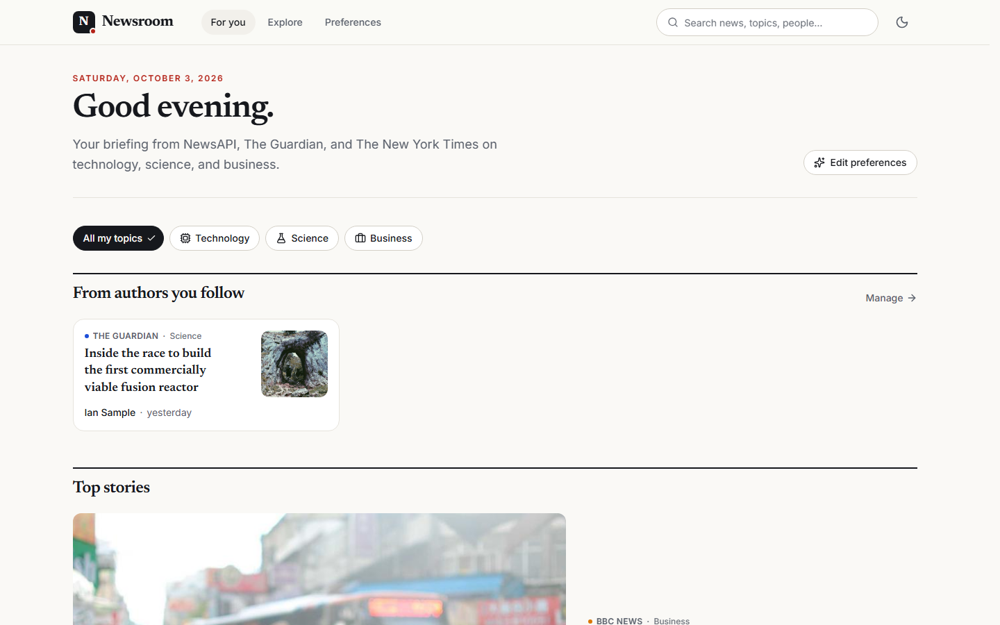
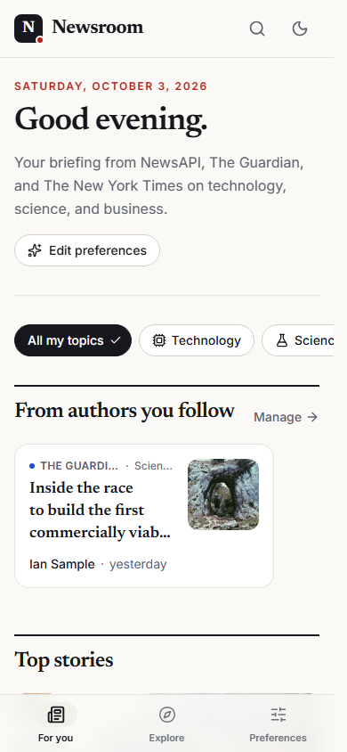
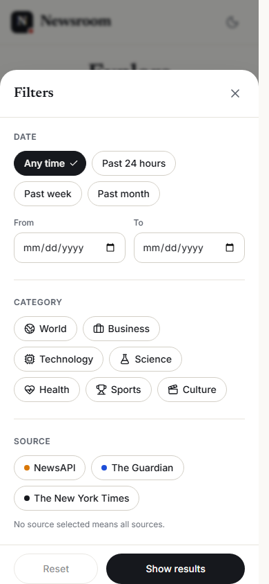
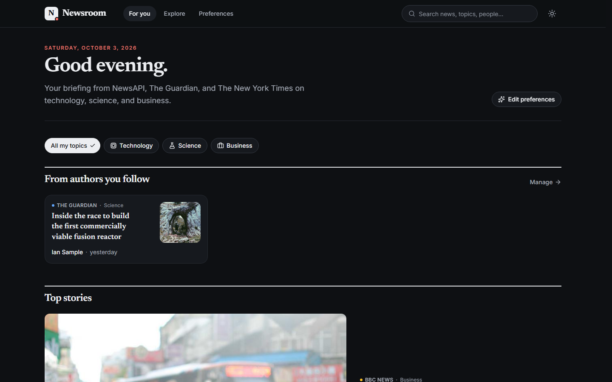

# Newsroom — News Aggregator

A responsive news aggregator built with **React 19 + TypeScript**. It pulls articles from **NewsAPI**, **The Guardian** and **The New York Times** into a single, clean reading experience with keyword search, filters and a personalised feed.



| Explore (search + filters)                       | Mobile feed                                      | Mobile filters                                               | Dark mode                                            |
| ------------------------------------------------ | ------------------------------------------------ | ------------------------------------------------------------ | ---------------------------------------------------- |
|  |  |  |  |

> Screenshots were captured with sample data so they look the same on every machine.

---

## Contents

- [Features](#features)
- [Quick start with Docker](#quick-start-with-docker)
- [Local development](#local-development)
- [Getting API keys](#getting-api-keys)
- [Architecture](#architecture)
- [Software design principles (DRY, KISS, SOLID)](#software-design-principles)
- [UI / UX decisions](#ui--ux-decisions)
- [Testing and quality](#testing-and-quality)
- [Known limitations](#known-limitations)

---

## Features

The table maps each requirement in the brief to how it's implemented.

| Requirement                          | Implementation                                                                                                                                                                                                     |
| ------------------------------------ | ------------------------------------------------------------------------------------------------------------------------------------------------------------------------------------------------------------------ |
| **Search by keyword**                | A large search field on _Explore_, plus a global search box in the header. Results come from all three providers at once.                                                                                          |
| **Filter by date, category, source** | Date presets (24h / week / month) and a custom from–to range, multi-select categories and multi-select sources. Every filter lives in the URL, so searches can be shared and bookmarked and the back button works. |
| **Personalised feed: sources**       | Preferences page with source cards. You must keep at least one source.                                                                                                                                             |
| **Personalised feed: categories**    | Topic chips. The feed queries only those topics and adds quick tabs to switch between them.                                                                                                                        |
| **Personalised feed: authors**       | Follow an author with one tap on any story, or type a name. Followed authors get their own "From authors you follow" row. The preferences page suggests authors you've been reading.                               |
| **Mobile-responsive design**         | Layout designed for phones first: a bottom tab bar, a bottom-sheet filter panel, and card grids that adapt with container queries. Checked at 390, 820 and 1440 px.                                                |
| **Docker**                           | Multi-stage image (Node build → nginx runtime) and `docker-compose.yml`. CI builds the image and smoke-tests it.                                                                                                   |

Extras: light and dark theme, infinite scroll with a "Load more" fallback, loading skeletons, graceful handling when one provider fails, lazy-loaded routes, and accessibility details (skip link, focus rings, labelled controls, `aria-pressed` chips, a native `<dialog>` with focus trap).

---

## Quick start with Docker

**Prerequisites:** Docker 24+ with Compose v2, and the three free API keys ([how to get them](#getting-api-keys)).

```bash
# 1. Clone
git clone https://github.com/pedro-ops-beep/news-aggregator.git
cd news-aggregator

# 2. Add your API keys
cp .env.example .env          # Windows cmd: copy .env.example .env
#    then edit .env:
#    NEWSAPI_KEY=...
#    GUARDIAN_API_KEY=...
#    NYT_API_KEY=...

# 3. Build and run
docker compose up --build -d

# 4. Open the app
open http://localhost:8080        # or just visit it in your browser
```

Stop it with `docker compose down`.

**First run vs. every run.** Steps 1–2 are a **one-time setup on each new machine**: `.env` holds your secret keys, so it is never committed and every clone needs its own. After that:

| When                                  | Command                                                         |
| ------------------------------------- | --------------------------------------------------------------- |
| First start, or after pulling changes | `docker compose up --build`                                     |
| Every other start                     | `docker compose up` (reuses the built image, starts in seconds) |
| Stop                                  | `Ctrl+C`, or `docker compose down`                              |

With Docker you never need Node.js or `npm install` on the host. Dependencies are installed inside the image.

<details>
<summary>Without Docker Compose (plain <code>docker</code>)</summary>

```bash
docker build -t newsroom .
docker run -d --name newsroom -p 8080:80 --env-file .env newsroom
# → http://localhost:8080

docker stop newsroom && docker rm newsroom
```

</details>

**How the container works**

- **Stage 1** (`node:24-alpine`) runs `npm ci` and `npm run build` to produce the static bundle.
- **Stage 2** (`nginx:alpine`) serves the bundle with an SPA fallback, gzip and long-term caching for fingerprinted assets.
- nginx also acts as a **reverse proxy** for `/api/newsapi`, `/api/guardian` and `/api/nyt`, and adds the API keys **when the container starts**, from environment variables:
  - **Keys never reach the browser.** They are not in the JavaScript bundle, and CI checks this.
  - **You don't need to rebuild to change keys.** Restart the container with new values.
  - **It avoids CORS problems.** NewsAPI's free plan rejects requests that come directly from a browser.
- If keys are missing, the app still starts and shows a "Connect your news sources" screen. If only some keys are missing, it shows a notice for those sources and keeps the others working.

---

## Local development

Requires Node.js **22.22+** (24 LTS recommended).

```bash
# One-time setup on each new machine (after cloning)
npm install                     # installs dependencies into node_modules/
cp .env.example .env            # Windows cmd: copy .env.example .env, then add your keys

# Every time you want to run the app
npm run dev                     # http://localhost:5173
```

`node_modules/` and `.env` are intentionally not in the repository, so every fresh clone needs the one-time setup. Run `npm install` again only after pulling changes to `package.json`.

The Vite dev server uses the **same `/api/*` proxy** as nginx (see `vite.config.ts`), so the app code is identical in development and production.

| Script                               | What it does                                            |
| ------------------------------------ | ------------------------------------------------------- |
| `npm run dev`                        | Dev server with HMR                                     |
| `npm run build`                      | Typecheck + production build to `dist/`                 |
| `npm run preview`                    | Serve the production build locally (with the API proxy) |
| `npm test`                           | Run the Vitest suite once                               |
| `npm run lint` / `npm run typecheck` | ESLint / TypeScript                                     |
| `npm run format`                     | Prettier (with Tailwind class sorting)                  |

### Troubleshooting

| Symptom                                                  | Fix                                                                                                                         |
| -------------------------------------------------------- | --------------------------------------------------------------------------------------------------------------------------- |
| `'vite' is not recognized…` / `vite: command not found`  | Dependencies aren't installed yet. Run `npm install` first.                                                                 |
| `npm install` fails with an engine/version error         | Install Node.js 22.22+ (24 LTS recommended) from <https://nodejs.org>, then reopen the terminal.                            |
| "Connect your news sources" screen                       | `.env` is missing or a key is wrong. Check there are no quotes or spaces, then restart `npm run dev` / `docker compose up`. |
| One source shows "API key is missing or invalid"         | That key was mistyped or isn't active yet. NYT keys need the **Article Search API** enabled and can take a few minutes.     |
| `port is already allocated` (Docker) or port 5173 in use | Stop the other app, or change `'8080:80'` in `docker-compose.yml` to e.g. `'3000:80'`.                                      |
| Docker build fails on Windows                            | Make sure Docker Desktop is running and uses **Linux containers** (the default).                                            |

---

## Getting API keys

All three are free and take about a minute each:

| Provider       | Sign up                                         | Notes                                                                               |
| -------------- | ----------------------------------------------- | ----------------------------------------------------------------------------------- |
| NewsAPI        | <https://newsapi.org/register>                  | Free plan: 100 requests/day, articles delayed ~24h, up to 1 month back              |
| The Guardian   | <https://open-platform.theguardian.com/access/> | Choose "Developer key", which is emailed to you                                     |
| New York Times | <https://developer.nytimes.com/get-started>     | Create an app and **enable the Article Search API**. Limit: 5 requests/min, 500/day |

**Why these three:** the brief lists seven sources, but only these three are usable today.

- "NewsAPI" and "NewsAPI.org" are the same service.
- OpenNews is a journalism community, not a news API.
- The NewsCred API has been discontinued.
- BBC News has no public API.

---

## Architecture

```
src/
├── app/                    # Composition root: providers, router, query client, error boundary
├── config/                 # Declarative config: categories (+ per-provider mapping), sources
├── types/news.ts           # Domain model: Article, ArticleQuery, SourceId, CategoryId
├── services/
│   ├── http/httpClient.ts  # The only place that calls fetch(), plus typed ApiError
│   ├── sources/
│   │   ├── NewsSource.ts   # ← the abstraction every provider implements
│   │   ├── newsapi/        # adapter + response types + mapper
│   │   ├── guardian/       #            〃
│   │   ├── nyt/            #            〃
│   │   ├── registry.ts     # which adapters are active
│   │   └── SourceRegistryContext.tsx  # dependency injection into React
│   └── aggregator.ts       # parallel fetch, merge, dedupe, sort, per-source failures
├── features/               # State and hooks, grouped by feature
│   ├── articles/useArticles.ts          # infinite, cached multi-source query
│   ├── search/useSearchFilters.ts       # filters ⇄ URL
│   ├── feed/usePersonalizedFeed.ts      # preferences → feed + followed-author row
│   ├── preferences/                     # persisted Zustand store, author suggestions
│   └── theme/
├── components/
│   ├── ui/                 # Design-system primitives: Button, Chip, Sheet, SearchField, EmptyState…
│   ├── article/            # ArticleCard (lead/standard/compact), ArticleFeed, skeletons
│   ├── filters/            # FilterPanel, DateRangeFilter, CategoryChips, SourceChips, ActiveFilters
│   └── layout/             # AppShell, Header, MobileNav (one nav config for both)
├── pages/                  # FeedPage, ExplorePage, PreferencesPage, NotFoundPage
└── utils/                  # Pure helpers: dates, text, arrays
```

### How a request flows

```
Page ─► useArticles(sources, query) ─► TanStack Query (cache, infinite pages)
            │
            ▼
      aggregator.fetchAggregatedPage ─► Promise.allSettled([...adapters])
            │                                   │
            │                     NewsApiSource / GuardianSource / NytSource
            │                         build provider URL ─► /api/<provider> ─► nginx / Vite proxy (+ key)
            │                         map response ─► Article[]
            ▼
   merged, deduplicated, newest first + list of failed sources ─► ArticleFeed
```

Each provider supports search and filters differently. The adapters hide those differences:

|          | NewsAPI                                               | Guardian              | NYT                                |
| -------- | ----------------------------------------------------- | --------------------- | ---------------------------------- |
| Keyword  | `/everything?q=`                                      | `q`                   | `q`                                |
| Date     | `from`/`to` (filtered on the client for headlines)    | `from-date`/`to-date` | `begin_date`/`end_date` (YYYYMMDD) |
| Category | `/top-headlines?category=` (one request per category) | `section=a\|b`        | `fq=section_name:("A" "B")`        |
| Paging   | 1-based, 20 per page, capped at 100 results           | 1-based, 20 per page  | 0-based, 10 per page               |

Category names are translated per provider in **one table**, [`src/config/categories.ts`](src/config/categories.ts). The NYT mapper accepts both the old and the 2025 response formats (`meta` vs `metadata`, and both multimedia shapes).

**State:**

| Kind of state      | Lives in                              | Why                                                                                                                                                           |
| ------------------ | ------------------------------------- | ------------------------------------------------------------------------------------------------------------------------------------------------------------- |
| Data from the APIs | TanStack Query                        | Caching (5-minute stale time, which matters with NYT's 5 requests/minute), request deduplication, infinite pagination, cancelling requests with `AbortSignal` |
| Search filters     | URL query string                      | Shareable and bookmarkable, no global store needed                                                                                                            |
| Preferences, theme | Zustand with `persist` (localStorage) | Small and simple. Stored values are validated when loaded                                                                                                     |

---

## Software design principles

**Single responsibility**

- Adapters only translate between a provider and the domain model. Their _mappers_ are separate pure functions.
- `httpClient` only does HTTP, and `aggregator` only combines results.
- Hooks own state; components only render.

**Open/closed**

- Adding a provider means writing a `NewsSource` adapter and adding one line in [`registry.ts`](src/services/sources/registry.ts). No page, hook or component changes.
- Adding a category means adding one entry in `categories.ts`.

**Liskov substitution**

- Every adapter honours the same `NewsSource` contract (`fetchPage(query, page, signal) → { articles, hasMore }`).
- The aggregator and the UI treat them interchangeably, and tests replace them with in-memory fakes.

**Interface segregation**

- `NewsSource` has a single method.
- Components take narrow props: `FilterPanel` gets `filters` and `onChange`, not the router; `ArticleCard` gets one `Article`.
- Store selectors subscribe each component only to the slice it reads.

**Dependency inversion**

- The UI depends on the `NewsSource` abstraction, injected through `SourceRegistryProvider`, never on concrete providers.
- `AppProviders` accepts a `registry` and `queryClient`, which is how the integration tests inject fakes.

**DRY**

- One `Article` model and one `ArticleCard` (with three variants) for every list.
- One `ArticleFeed` handles loading, error, missing-key, empty and paginated states for both the feed and search pages.
- `CategoryChips` and `ToggleChip` are shared by filters, preferences and feed tabs.
- `buttonStyles()` styles both `<button>` and router `<Link>`.
- `NAV_ITEMS` drives both the desktop header and the mobile tab bar.
- The `/api/*` proxy contract is the same in Vite and nginx.

**KISS**

- No Redux, no backend service, no CSS-in-JS runtime.
- The bottom sheet is a native `<dialog>`, which gives a focus trap and Esc-to-close for free.
- Search runs on submit instead of on every keystroke.
- Authors are matched with a plain normalised substring check.

---

## UI / UX decisions

**Visual style**

- An editorial look:
  - **Newsreader** serif for headlines.
  - **Inter** for interface text.
  - A warm paper background with a single news-red accent.
- Fonts are self-hosted through Fontsource as variable fonts, so there are no third-party font requests.
- **Semantic design tokens** (`bg-surface`, `text-ink-muted`…) are defined once in `index.css`. Dark mode only redefines those tokens, so no component code changes.

**Layout and responsiveness**

- **Container queries** let the same grid adapt whether it fills the page or sits next to the filter sidebar.
- On mobile:
  - A bottom tab bar within thumb reach.
  - Filters in a bottom sheet.
  - Rows that scroll sideways with snap points.
  - Tap targets at least 44 px, and spacing for the iPhone safe area.

**Cards**

- The whole card is clickable (a "stretched" link), while the Follow button stays separately usable.
- Images have a fixed aspect ratio, so the layout doesn't shift while they load.
- Missing or broken images show a branded placeholder with the publisher name.

**Feedback states**

- Loading skeletons match the final layout.
- Empty and error states explain what to do next.
- When one source fails, a non-blocking notice names it and offers Retry, and stories from the other sources still show.

**Performance**

- Secondary routes are lazy-loaded.
- Images load lazily, except the lead story's image, which loads first.
- `ArticleCard` is memoised.
- Requests are cached and cancelled with `AbortSignal` when the user navigates away.

**Accessibility**

- Skip link, visible focus rings, and labels on every input and icon button.
- `aria-pressed` on toggle chips and a polite live region for the results heading.
- Colour contrast is AA or better.
- `prefers-reduced-motion` is respected.

---

## Testing and quality

```bash
npm test
```

27 tests in 6 files:

- **Adapters** (`sources.test.ts`): request building for each provider (endpoint choice, category mapping, date formats, paging) and response mapping. Includes both NYT response formats and typed HTTP errors.
- **Aggregator**: merging, deduplication, ordering, partial failures, and querying only the selected sources.
- **URL filter state**: round-trips through the URL and ignores invalid values.
- **Preferences store**: you can't remove the last source, authors are de-duplicated, preferences persist.
- **Page integration tests** (with fake injected sources):
  - Search and filters update the URL and the query.
  - A partial-failure notice appears when one source fails.
  - The missing-keys screen appears when every source rejects its key.
  - Following an author fills the authors row.
  - The feed queries only the preferred sources and topics.

CI ([`.github/workflows/ci.yml`](.github/workflows/ci.yml)) runs lint, format check, typecheck, tests and the build. It then **builds the Docker image, starts it and checks** that:

- the app and its client-side routes load;
- all three proxies reach their providers;
- the API keys are not in the bundle.

---

## Known limitations

- **Author filtering:** none of the providers can reliably filter by author. NewsAPI has no author parameter at all. Followed authors are found by searching their names and keeping only stories whose byline matches.
- **NewsAPI free plan:**
  - Articles are delayed about 24 hours and only go back a month.
  - A single query returns at most 100 results.
  - `/top-headlines` (needed for categories) has no date filter, so dates are filtered on the client there.
- **NYT rate limit (5 requests/minute):** results are cached for 5 minutes and search runs on submit, but very fast filter changes can still hit the limit. The app shows a friendly notice and keeps the other sources.
- **Preferences are per device:** they are stored in localStorage, since there is no user account.
